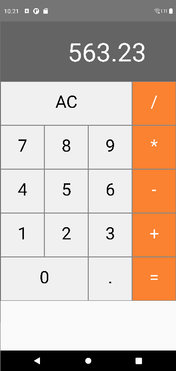

<h1 align="center">Calculadora</h1>

Projeto construido em react-native para criar uma calculadora.

## Telas


## ⚙️ Como executar o projeto
```bash
# Clone este repositório
$ git clone https://github.com/rsalcir/calculadora-app.git

# Acesse a pasta infra do projeto tasks-backend-node
$ cd calculadora

# Execute o comando:
$ npx react-native run-android
```


